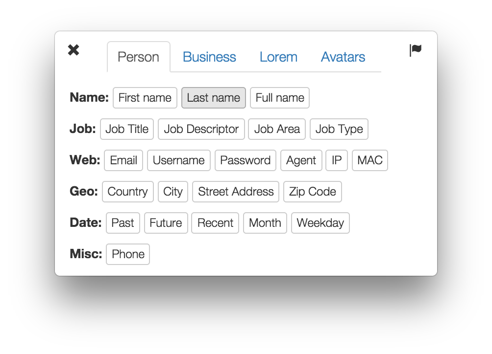
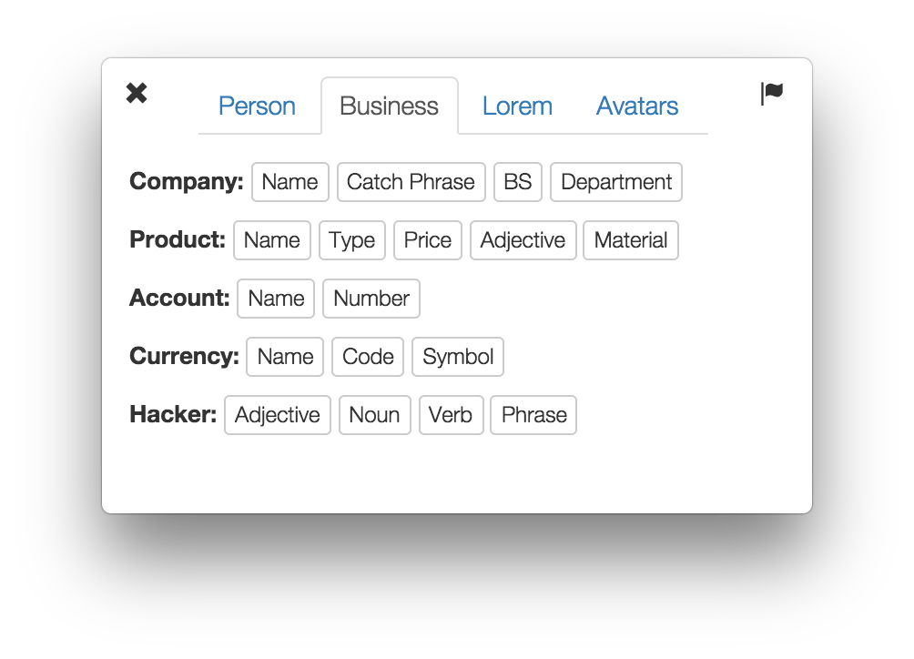
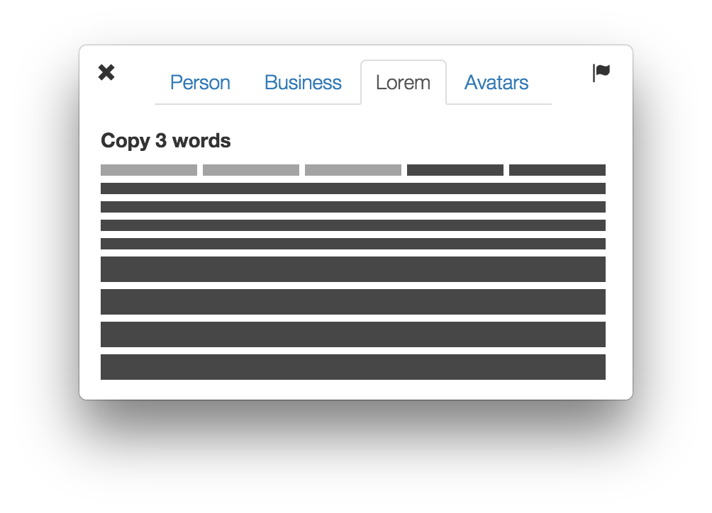

# menubar-faker

> OSX app for quickly generating fake data. Nice to have when creating wireframes or mock-ups for UI design.

Built with :heart: and [electron](https://github.com/atom/electron).

###[Download](https://github.com/simon-johansson/menubar-faker/releases/tag/0.0.1)

##Usage

1. Start the app. It will show up as a cat in your menu bar.
2. Click the cat to open the selection window.
3. Choose the thing that you need generated. You will now have it copied to your clipboard, just `cmd+v` it to wherever!

####Tips
* Use `cmd+g` to generate and paste new text on the fly of the last chosen type!
* Click the flag  in the upper right corner to change the language of the generated texts.

##Screenshots

  

  

  

  

